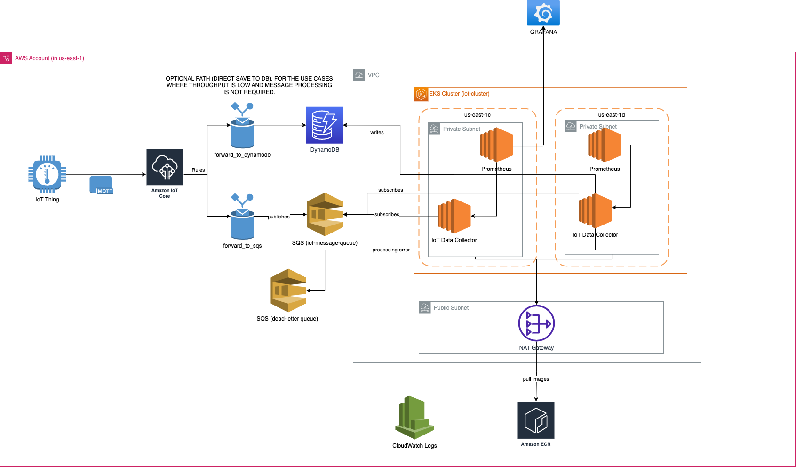

# 📡 IoT Data Collector – Local & Cloud-Ready Data Ingestion Pipeline

A containerized IoT data ingestion pipeline built with a local-first approach using MQTT, MongoDB, Prometheus, and Grafana — then extended to AWS with IoT Core, SQS, DynamoDB, EKS, and VPC components using Infrastructure as Code (IaC) best practices.

---

## 🚀 Features

- ✅ **MQTT Ingestion** via Mosquitto for receiving device data.
- ✅ **Node.js Backend** consumes MQTT, stores data in MongoDB.
- ✅ **MongoDB Storage** for incoming MQTT messages
- ✅ **Prometheus Metrics** for system observability, scrapes and stores custom metrics
- ✅ **Grafana Dashboards** dashboards for monitoring message rate, DB inserts, HTTP traffic (auto-provisioned via YAML/JSON)
- ✅ **Fully Dockerized Stack** with `docker-compose`
- ✅ Includes Jest-based testing with mocks
- ✅ **Metrics Include**:
  - MQTT messages received
  - MongoDB inserts
  - HTTP API requests


---

## 📁 Folder Structure

```
iot-data-collector/
├── backend/
│   └── api/
│   │   ├── package.json
│   │   ├── Dockerfile
│   │   ├── app.js          # Express app with routes and Prometheus metrics
│   │   ├── index.js        # MQTT + MongoDB integration and app startup
│   │   ├── tests/
│   │   │   ├── api.test.js     # API tests
│   │   │   ├── mqtt.test.js    # MQTT + MongoDB integration tests (mocked)
├── docs/
│   └── iot-data-collector.drawio.png   #Cloud Architecture Diagram
├── infra/
│   ├── cicd/
│   ├── k8s/
│   │   ├── iot-api-deployment.yaml
│   │   ├── iot-api-service.yaml
│   ├── terraform/
│   │       ├── modules/
│   │       │   ├── apps
│   │       │   │   └── main.tf
│   │       │   │   └── outputs.tf
│   │       │   ├── dynamodb
│   │       │   │   └── main.tf
│   │       │   ├── eks
│   │       │   │   └── main.tf
│   │       │   │   └── variables.tf
│   │       │   ├──  iot
│   │       │   │   └── main.tf
│   │       │   │   └── outputs.tf
│   │       │   │   └── variables.tf
│   │       │   └── vpc
│   │       │       └── main.tf
│   │       └── main.tf
│   │       └── outputs.tf
│   │       └── variables.tf
├── mqtt/
│   ├── config/
│   │   └── mosquitto.conf
│   ├── data/
│   │   └── mosquitto.db
│   └── log/
│       └── mosquitto.log
├── monitoring/
│   ├── grafana/
│   │   └── provisioning/
│   │       ├── dashboards/
│   │       │   └── mqtt-dashboard.json
│   │       └── datasources/
│   │           └── prometheus-ds.yml
│   └── prometheus/
│       └── prometheus.yml
├── docker-compose.yml
├── jest.config.js
└── README.md
```

---


## 📐 Local (On Prem) Architecture

```text
           [MQTT Device]
                ↓
         ┌────────────────┐
         │   Mosquitto    │
         └────────────────┘
                ↓
         ┌────────────────┐
         │   Node.js App  │◀─── GET /
         └────────────────┘
         ↓               ↓
 [MongoDB Inserts]   [Prometheus /metrics]
                          ↓
                    ┌──────────┐
                    │ Grafana  │
                    └──────────┘
```                  


---

## ☁️ Cloud Architecture (AWS)

The solution was designed to be cloud-ready and migrated to AWS services for scalability, resilience, and security. 

Key services used:
- **Amazon IoT Core** for device ingestion via MQTT.
- **Amazon SQS** for decoupled, reliable message processing.
- **Amazon DynamoDB** for optional direct storage (low-latency paths).
- **Amazon EKS** hosts the IoT data collector and Prometheus instances.
- **Grafana** deployed in-cluster for visualization.
- **VPC, Subnets, NAT Gateway** for secure networking and private connectivity.
- **CloudWatch Logs** for centralized logging.

📌 The full cloud architecture diagram is included in [`docs/architecture.drawio`](docs/iot-data-collector.drawio.png).



---

## ☁️ Cloud Deployment Overview

This project includes a cloud-native migration path:

- IoT devices send data to **Amazon IoT Core** via MQTT.
- IoT Core uses **Rules Engine** to route data to:
  - **SQS** (main ingestion path)
  - **DynamoDB** (optional low-throughput use cases)
- An **EKS-based data collector** consumes messages from SQS, stores them in Prometheus.
- Monitoring is provided by **Prometheus + Grafana**, deployed in the same EKS cluster.
- Infrastructure is secured within a **VPC** with private/public subnets, NAT Gateway, and VPC Endpoints.
- Deployment is done via Terraform. Ready for automation.

📁 See the [architecture diagram](docs/iot-data-collector.drawio.png) for details.

---

## 🐳 Docker Compose Setup

All services are managed via `docker-compose.yml`.

```bash
git clone https://github.com/gokselsarikaya/iot-data-collector.git
cd iot-data-collector
docker-compose up --build
```

## Access Services

| Service    | URL                                            |
| ---------- | ---------------------------------------------- |
| API        | [http://localhost:3000](http://localhost:3000) |
| Prometheus | [http://localhost:9090](http://localhost:9090) |
| Grafana    | [http://localhost:3001](http://localhost:3001) |

---

## 📈 Monitoring & Observability

- **Metrics Endpoint:** Exposed at `/metrics` by Node.js API.
- **Prometheus:** Scrapes metrics from API.
- **Grafana:** Visualizes metrics via predefined dashboards.

### Metrics:

| Metric                         | Type    | Description                         |
| ------------------------------ | ------- | ----------------------------------- |
| `http_requests_total`          | Counter | Total HTTP requests to `/` route    |
| `mqtt_messages_received_total` | Counter | Total MQTT messages received        |
| `mongo_inserts_total`          | Counter | Total documents inserted into Mongo |


---

## ✅ Grafana Dashboard

Provisioned automatically from:
- `monitoring/grafana/provisioning/dashboards/dashboards.yaml`
- `monitoring/grafana/provisioning/datasources/prometheus.yaml`

Make sure `datasource.uid` in the dashboard matches the Prometheus config (`uid: prometheus`).

---


## 🧪 Sending Test MQTT Messages

You can send test messages using mosquitto_pub (inside the broker container):
```bash
docker exec -it mosquitto sh
mosquitto_pub -h localhost -t iot/topic -m "Test message"
```
Or use MQTT client GUI tools like MQTT Explorer or MQTT.fx.

---
##  Running Tests
```bash
npm install
npm test
```

Tests include:
Basic HTTP route tests (api.test.js)
MQTT + MongoDB insert logic (mocked in mqtt.test.js)

---

## 🧠 What I’d Do With More Time

- Automate the AWS deployment using Terraform or CDK.
- Add E2E integration tests using real AWS services (IoT Core → SQS → EKS).
- Set up CI/CD pipeline using GitHub Actions or AWS CodePipeline.
- Implement fine-grained IAM policies for least privilege.
- Expand Prometheus rules with alerts (e.g., dead-letter queue thresholds).
- Add support for schema validation and rate limiting on the ingestion path.
- Gather more NFR and implement design.

---
